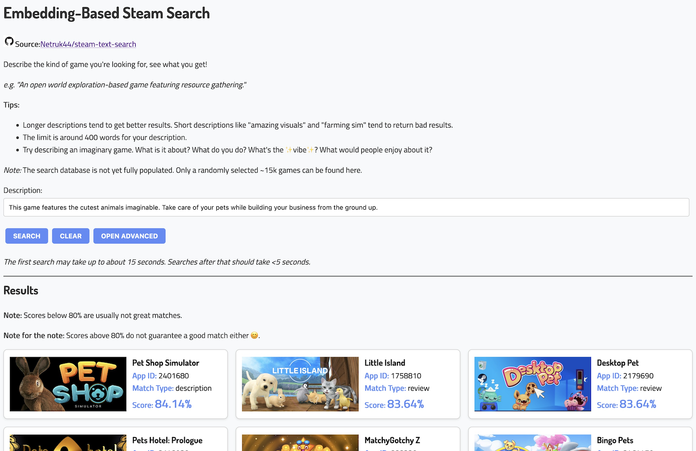

## Live Demo

See the react interface live [here](https://netrukpub.z5.web.core.windows.net/steamvibes/build/index.html) (for as long as I keep the API running).

## Description
Search for Steam games based off a text description.

Describe the kind of game you're looking for, and get a list of games that closest match the vibe you're looking for based off the store description and reviews.

## Requirements
- Python
- Linux or Mac
    - Ability to execute `.sh` scripts.
    - Windows untested, might work with WSL. (GPU support unknown/unlikely)
- ~20 GB disk space to hold libraries and models.
    
### Recommended
- A GPU with > 6 GB VRAM
- Lots of time 😊

## Install
- Clone this repository.
- Install Python, if you don't already have it.
- ~~Download prepopulated database [here](#) (*X.XX GB*).~~
    - ~~Will let you skip to step 04, bypassing GPU requirement and many hours of calling Steam API.~~
    - Not yet available.

## Usage
- There are multiple numbered folders in this repository that should be run in order.
- In each directory, there is an `init.sh` script that will create a virtual environment directory (e.g. `.venv_01` for step 01) and install the required dependencies for that step.
- Once the virtual environment is created, activate it (e.g. `source ./.venv_01/bin/activate`), then run `python run.py`.
- The first step will initialize and populate a database.
- You should use the same database file for all steps.
    - Scripts will only add/process new data for that step, so you can run them multiple times as you add more data to the database.

### 01_gamedataset
- **Requirements**: A web connection, time (~6 hours)
- **Overview**: Queries the Steam API to populate the database with steam app ids, game names, store descriptions, and top 100 reviews (decided by Steam).
- Use `--new` to create a new database.
- Rate limited to 1 request per 1.5 seconds, to meet Valve's rate limiting policy.
- Currently only populates randomly selected app ids with store descriptions and reviews per run.
    - Controllable with `--limit <number>` (default 5,000)
    - Populating the database with all 180k app ids and their reviews will take about a week.
- Takes about 2 hours for 1,000 app ids, 6-10 hours for 5,000 app ids.
- Re-running the script with the same database will add more app ids to the database.
- Example invocation: `python run.py --db ./steam.db --limit 1000`

### 02_embeddings
- **Requirements**: A CUDA GPU (highly recommended), or without that, time (a couple hours)
- **Overview**: Creates embeddings for the store descriptions and reviews.
- Uses [Instructor](https://huggingface.co/hkunlp/instructor-large) to create embeddings.
- Can specify which model is used with the `--model-name` argument.
    - `--model-name hkunlp/instructor-large` (default, requires 2.5 GB VRAM)
    - `--model-name hkunlp/instructor-xl` (highly recommended, requires ~6 GB VRAM)
- With RTX 3090, takes about 30 minutes per 5,000 new items added by step 01.
- Example invocation: `python run.py --db ./steam.db --model-name hkunlp/instructor-xl`

### ~~03_index~~
- **TODO**: Use FAISS to index the embeddings to search quickly.
- Not yet implemented.

### 04_querydataset
- **Requirements**: Fairly low. A CPU with 3-6 GB of RAM.
- **Overview**: Queries the database for games that match a given query.
- Takes about 10 seconds to complete and return results.
    - Most of the time spent in this script is loading Instructor to generate an embedding for your query.
- **Important**: Use the same `--model-name` you used to generate the database in step 02.
- You can use `--query-for-type <type>` to limit search to `all`, `description` or `review` embeddings.
- Example invocation: `python run.py --db ./steam.db --query "I want a game that is like a mix of Minecraft and Skyrim"`

### 10_flask-embedding-api
- **Requirements**:  Same as 04
- **Overview**: A Flask API that can be used to query the database.
- **Important**: Not very configurable at the current moment. Has hardcoded assumptions about the database and model.
- Includes Dockerfile and docker-compose.yml for easy deployment.
- Can also be executed with `gunicorn` or `flask run`.
- Example invocation: `python run.py`

### 11_react-interface
- **Requirements**: Static file hosting.
- **Overview**: A simple React interface for querying the API.
- **Important**: Not very configurable at the current moment. API is hardcoded to my home computer.
- Use `npm run build` to build the static files (available in `./build`).
- Use `npm start` to start a development server.

## Example Results

> **Note**: These results are from a small testing dataset of 5,000 games. The results should be better with a larger dataset.

Output is formatted as:
```
  <app_id>: <game_name> (<source>)
    Match: <cosine_similarity>
```
- `app_id`: The Steam app id for the game.
- `game_name`: The name of the game.
- `source`: The source of the embedding. Either `description` or `review`.
- `cosine_similarity`: The cosine similarity between the query and the embedding.

### Query: "I want a game that is like a mix of Minecraft and Skyrim"
```
  1748370: The Hunt (review)
    Match: 78.49%
  1466060: Tainted Grail: The Fall of Avalon (review)
    Match: 78.28%
  611670: The Elder Scrolls V: Skyrim VR (review)
    Match: 78.03%
  2157290: Azarine Heart (review)
    Match: 77.88%
  641980: Block Survival: Legend of the Lost Islands (review)
    Match: 77.04%
  367030: Lootfest (review)
    Match: 76.45%
  2175570: Eternamine (review)
    Match: 76.21%
  1604030: V Rising (review)
    Match: 76.20%
  1179410: Lootcraft (review)
    Match: 76.15%
  1507910: Survival Engine (review)
    Match: 76.06%
```

### Query: "Fast-paced arcade racing game"
```
  848260: Super GTR Racing (description)
    Match: 80.96%
  1586930: Extreme racing (description)
    Match: 80.66%
  808080: Ultimate Racing 2D (description)
    Match: 80.59%
  1318280: OverShoot Battle Race (review)
    Match: 80.46%
  661290: Arizona Derby (review)
    Match: 80.11%
  397640: Nulldrifters (review)
    Match: 79.83%
  1814150: Atomic Cyclecar Racing (review)
    Match: 79.77%
  2178650: Fastraq (description)
    Match: 79.64%
  1634090: Mini Racing World (review)
    Match: 79.59%
  1927710: Supreme Race on Highway (review)
    Match: 79.41%
```

### Query: Cozy, 3d first person game with resource gathering and a relaxing atmosphere
```
  1758320: Lofty Quest (review)
    Match: 85.18%
  360840: Lumini (review)
    Match: 83.94%
  1783370: Aery - Dreamscape (review)
    Match: 83.53%
  1536520: Equinoxe (review)
    Match: 81.90%
  612740: Bokida - Heartfelt Reunion (review)
    Match: 81.85%
  406220: Gnomes Vs. Fairies (review)
    Match: 81.68%
  2487460: Lost Forest (review)
    Match: 81.53%
  1121140: Ionia (review)
    Match: 81.53%
  1941890: Santo Island Incident (review)
    Match: 81.43%
  1481000: Triversal (review)
    Match: 81.43%
```

## Misc
### Related Pages

**Related Repository:** https://github.com/Netruk44/repo-search
- Previous version of this idea.
- Searches through text documents/code for content that matches a description.